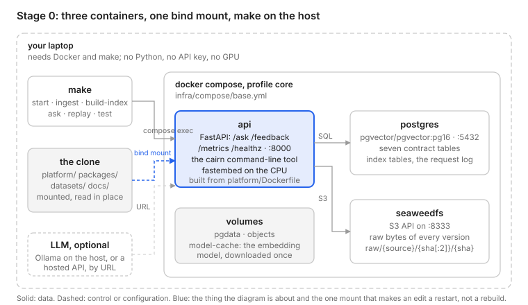

# Data Engineering for AI

**The model is the easy part. Build the data systems around it.**

Production AI is a data system with a model in the loop. The model can be swapped in an
afternoon; the data platform decides whether the system is correct, current, reproducible
and affordable. This repository is the platform behind the series: **Cairn**, one AI
knowledge platform built in ten stages across ten chapters, plus the standalone flagship
projects and the shared packages they use. Every stage is a tag and a working system.

Series: https://aiteachinglabs.com/series/data-engineering-for-ai/

## What is here today

| Path | What | Series |
| --- | --- | --- |
| `packages/schemas/` | The data contracts: seven Pydantic models generating Avro, Iceberg DDL, JSON Schema and Postgres DDL; the contract tests | A2, A3 |
| `docs/architecture/reference.md` | The reference architecture: seven subsystems, nine contracts, the lineage spine | A2 |
| `docs/architecture/diagrams/` | Diagram sources and exports | A1, A2 |
| `docs/adr/` | Decision records (0001 seven subsystems, 0002 Pydantic as the single source, 0003 Postgres as the Stage 0 lakehouse) | A2, A3 |
| `platform/` | Cairn at `stage-0`: the walking skeleton, every subsystem present in one Docker Compose | A3 |
| `infra/compose/` | `base.yml`, profile `core`: postgres (pgvector), seaweedfs (S3), api | A3 |
| `datasets/` | The small tier (Apache Iceberg docs) and the golden set; licences in `datasets/LICENSES.md` | A3 |
| `projects/` | Flagship projects: arrive from Chapter 2 on | A5 onward |

## Run it

Stage 0, on a laptop with Docker and `make` (16 GB of memory; no Python, no API key, no GPU):

```bash
git clone https://github.com/<you>/data-engineering-for-ai && cd data-engineering-for-ai
git checkout stage-0
make start        # three containers: postgres, seaweedfs, api
make ingest       # the series' own docs and the Apache Iceberg documentation
make build-index  # one index table, one IndexSnapshot row
make ask Q="How does Iceberg hidden partitioning work?"
make replay REQ=<the request_id it printed>
make test         # the platform suite (16 unit + 13 seam tests) against the running containers
```



`make help` lists everything else (`lag`, `eval`, `feedback`, `stats`, `metrics`, `psql`,
`down`). Swap the generator for one question with any OpenAI-compatible endpoint:

```bash
CAIRN_LLM_BASE_URL=http://host.docker.internal:11434/v1 CAIRN_LLM_MODEL=llama3.2 CAIRN_LLM_PROVIDER=ollama \
  make ask Q="How does Iceberg hidden partitioning work?"
```

To develop (lint, contract tests, the platform suite on an embedded Postgres, no Docker needed):

```bash
make setup             # uv sync; needs uv (https://docs.astral.sh/uv/); uv fetches Python 3.12
make lint
make test-contracts    # packages/schemas
make test-platform     # platform/tests, on an embedded Postgres with the hashing embedder
make schemas           # regenerate Avro / Iceberg DDL / JSON Schema / Postgres DDL from the models
```

## Layout

```text
data-engineering-for-ai/
├── Makefile              toolchain targets, and start · ingest · build-index · ask · replay · test for Stage 0
├── pyproject.toml        uv workspace root (members: packages/*, platform)
├── .github/workflows/    ci.yml (lint, schema drift, contract + unit + seam tests); integration.yml (compose up, ingest, ask, seam tests)
├── packages/schemas/     cairn-schemas: the contracts and their generators (see its README)
├── platform/             cairn: the platform, one subpackage per subsystem (see its README)
├── infra/compose/        base.yml, profile core
├── datasets/             small tier, golden sets, LICENSES.md
├── docs/architecture/    reference.md, diagrams/
└── docs/adr/             decision records
```

## Licence

Apache-2.0. See `LICENSE`.
