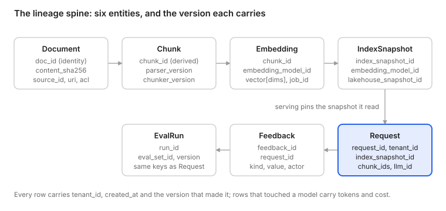

# Cairn reference architecture

**Seven subsystems and the contracts between them.** This is the canonical source of the
A2 article; the site renders the same Markdown. The models behind every entity named here
live in [`packages/schemas/`](../../packages/schemas/README.md), and the tests that prove
each contract are in `packages/schemas/tests/`.

A box diagram tells you what exists. An architecture tells you what each part promises
the next one, and what breaks when the promise fails. Three properties ride on every
contract:

| Property | What it means on the wire | Why |
| --- | --- | --- |
| Freshness | A timestamp at every hop (`created_at`, `fetched_at`, `built_at`, `received_at`) | Lag between any two hops is a computed number, never a guess |
| Lineage | The version of every model and transform that touched a row (`LINEAGE_FIELDS`) | A derived row can be invalidated, backfilled and replayed by version |
| Cost | Tokens and dollars on every row that touched a model (`Costed`) | Every token is attributed to a tenant, a request or a job |

The rule that follows: identifiers, versions and timestamps go on every row before
anything else is built. They are cheap at write time and impossible to reconstruct later.

## Seven subsystems, seven guarantees

| # | Subsystem | Owns | Invariant | The failure it prevents | Arrives |
| --- | --- | --- | --- | --- | --- |
| 1 | Ingestion and registry | Source connectors, dedup, provenance, change detection | Every input gets a stable ID and a content hash at the door | A re-crawl of 200K pages reprocesses all of them when 0.5% changed | Stage 1, Chapter 2 |
| 2 | Lakehouse | Raw, parsed, chunk, embedding, event and log tables | Single source of truth; everything else is rebuildable from it | A lost index is an outage instead of a rebuild | Stage 1, Chapter 2 |
| 3 | Derivation | Parse, chunk, dedup, embed, featurize | Every output carries the version of the model that made it | A parser upgrade becomes a bug hunt instead of a backfill | Stage 2, Chapter 3 |
| 4 | Indexes | Vector, lexical, online feature store | Derived, disposable, with a measured lag against the lakehouse | Day 23 (A1): a stale index served for fourteen days with every dashboard green | Stage 3, Chapter 4 |
| 5 | Serving and lineage | Retrieval, context assembly, model call, request log | Any response is reproducible from its `request_id` | "What did it see?" has no answer thirty days later | Stage 4, Chapter 5 |
| 6 | Feedback and evaluation | Events, eval sets, eval runs, training data | Data changes pass the same gates as code changes | A new index ships on a 12-point contaminated score | Stage 6, Chapter 7 |
| 7 | Observability and cost | Traces, freshness, drift, token ledger | Every silent failure has a computed alarm; every token is attributed | The empty-result rate climbs from 2% to 9% and nobody is paged | Stage 7, Chapter 8 |

The subsystems are contracts, not containers. At 10K users all seven live in one Postgres
and one process; at 100M users they are fleets. The components change at every rung and
the contracts do not (see [ADR-0001](../adr/0001-seven-subsystems.md)).

## The lineage spine

Read left to right along the top and down into serving. Each entity's key is on its first
line and the versions it carries are below; `Request` is the row that joins everything, and
the arrow into it is the moment a response gets its lineage. Source:
[`diagrams/lineage-spine.mmd`](diagrams/lineage-spine.mmd).

| Entity | Table | Key | Carries | Enforces |
| --- | --- | --- | --- | --- |
| `Document` | `documents` | (`doc_id`, `revision`); `content_sha256` is the version | `uri`, `content_type`, `size_bytes`, `fetched_at`, `source_updated_at`, `acl`, `status`, `raw_object_key` | Identity survives edits; one changed byte is a new version; a delete is a revision with `status='deleted'`, never a missing row |
| `Chunk` | `chunks` | `chunk_id` = hash(`doc_id`, `parser_version`, `chunker_version`, `text_sha256`, `occurrence`) | `content_sha256`, `ordinal`, `byte_start`, `byte_end`, `text`, `token_count`, `metadata`, inherited `acl` | Unchanged text keeps its id across revisions and position shifts, so only changed chunks are re-embedded |
| `Embedding` | `embeddings` | (`chunk_id`, `embedding_model_id`) | `text_sha256`, `vector` (float32), `dims`, `job_id`, tokens and cost | No index holds two models; the model id is the namespace |
| `IndexSnapshot` | `index_snapshots` | `index_snapshot_id` = hash(`index_name`, `embedding_model_id`, `lakehouse_snapshot_id`) | `index_name` (`{base}--{model slug}`), `built_at`, `row_count`, `lag_seconds_at_build`, `status` | An index is a function of one lakehouse snapshot and one model, and says which |
| `Request` | `requests` | `request_id` (UUIDv7, minted at the edge) | `query_sha256`, `prompt_template_version`, `retrieval_config_version`, `index_snapshot_id`, `embedding_model_id`, `filters`, `retrieved_chunks` (`chunk_id`, `text_sha256`, score, rank), `reranker_id`, `llm_id`, `llm_params`, `response_sha256`, per-stage latency, tokens and cost, `trace_id` | The retrieved set is reproducible from the row; the response is explainable from it |
| `Feedback` | `feedback` | `feedback_id`; `dedup_key` unique per tenant | `request_id`, `kind`, `value`, `comment`, `actor`, `received_at`, `event_schema_version` | Every signal joins to a request; feedback is evidence, never an approval to train |
| `EvalRun` | `eval_runs` | `run_id` | `eval_set_id` and version, `config` (the same version keys as `Request`), `metrics`, `baseline_run_id`, `git_sha`, tokens and cost | A run pins every version it used; two runs with equal configs are comparable |

Every row carries `tenant_id`, `created_at` and `schema_version`. A5 adds `Source`, A8 adds
`Parse`, A23 adds `Event`.

## Nine contracts on the arrows

Every payload carries IDs, versions and timestamps. Every producer is at-least-once, so
every consumer is idempotent on the payload's key. Deletes travel as tombstones, never as
absence. Nothing is read from a store other than the one the contract names: derivation
reads the lakehouse, not the source; serving reads the index, not the lakehouse.

| # | Producer -> consumer | Payload | Guarantee | Test | Prevents | Status at `stage-0` |
| --- | --- | --- | --- | --- | --- | --- |
| C1 | Ingestion -> Lakehouse | `Document` + raw bytes at `raw/{source}/{sha[:2]}/{sha}` | Stable `doc_id`; `content_sha256`; deletes as tombstones; `fetched_at` and `source_updated_at` on every row | Ingest twice, registry unchanged; change a byte, new version (`test_contracts.py::test_c1_*`); against real containers: `test_ingest_twice_is_a_no_op`, `test_edit_is_a_new_revision_of_the_same_document`, `test_removed_file_becomes_a_tombstone` | Reprocessing the unchanged 99.5% | Real: filesystem connector, Postgres registry, MinIO raw bytes, tombstones with `--prune` |
| C2 | Lakehouse -> Derivation | The set of document versions lacking output for the current (parser, chunker, model) versions | Derivation reads only the lakehouse; the dirty set is computed, never remembered | A killed job resumes with no duplicates; `test_chunker_version_change_is_a_backfill` | Lost or doubled work after failure | Thin: the dirty set is two SQL anti-joins (`derivation/pipeline.py`) over one process; the distributed job arrives at Stage 2 (A9, A11) |
| C3 | Derivation -> Lakehouse | `Chunk`, `Embedding` | Deterministic IDs; version columns on every row; MERGE on the key | `chunk_id` determinism; an edit changes one chunk; a chunker upgrade is a backfill (`test_c3_*`, `test_edit_reembeds_exactly_one_chunk`, `test_chunker_version_change_is_a_backfill`) | A parser upgrade becoming a bug hunt | Real: `md-raw-v1` + `md-struct-v1` + fastembed, writes keyed as the contract says |
| C4 | Lakehouse -> Indexes | `Embedding` for one model, `Chunk` metadata and ACL; an `IndexSnapshot` per build | The index is a function of one snapshot and one model; `index_lag_seconds` is computed by reading both stores | `test_build_writes_snapshot_and_lag_is_zero`, `test_ingest_after_build_raises_lag` | Day 23 | Real for one pgvector index with full rebuilds and a live pointer; `cairn lag` and `/metrics` compute the lag; incremental sync and reconciliation of a remote index arrive at Stage 3 (A15) |
| C5 | Indexes -> Serving | Query (vector or text; filters for tenant, ACL, time; k) -> (`chunk_id`, score, `index_snapshot_id`) | Filters are applied inside the query; the snapshot id is returned with every result | Adversarial ACL fixture returns nothing it should not | Permission leaks; unexplainable results | Thin: vector-only retrieval against the live snapshot's table, tenant filter inside the query, one tenant; the ACL fixture arrives at Stage 4 (A22) |
| C6 | Serving -> Lakehouse | `Request` (hot in Postgres, cold in Iceberg) | Written with every lineage id before the response is returned, or enqueued durably | Replay 100 requests: identical retrieved chunk ids (A21); every lineage field required; Avro round-trip (`test_c6_*`) | "What did it see?" with no answer | Real: `/ask` writes the row before it answers (`test_ask_writes_request_before_responding`); `cairn replay` re-runs retrieval against the logged snapshot (`test_replay_reproduces_retrieved_chunk_ids`); replay at scale is A21 |
| C7 | Application -> Feedback | `Feedback`, later `Event` | Typed, versioned schema; at-least-once with a dedup key; every row joins to a request | Duplicate delivery counts once; orphan feedback is rejected (`test_duplicate_feedback_counts_once`) | Double-counted signals | Real for `/feedback` with a unique `(tenant_id, dedup_key)`; the event stream arrives at Stage 5 (A23) |
| C8 | Evaluation -> Serving and Derivation (the gate) | `EvalRun` compared to a baseline | No prompt, retrieval, index or model change goes live without a run against baseline | CI refuses the change without a run; `test_eval_run_config_matches_request_keys` | Shipping a contaminated 12-point gain | Thin: `cairn eval` runs a 20-question golden set and writes an `EvalRun` whose config equals the requests' lineage; no gate yet (Stage 6, A28) |
| C9 | Everything -> Observability | OTel spans carrying the same ids the tables carry; freshness monitors reading the lakehouse and the indexes | Traces and tables join on `request_id`, `chunk_id`, `index_snapshot_id`; cost sums reconcile to the ledger | Sum of request costs equals the ledger; an induced lag pages (`test_metrics_expose_lag_and_cost`) | Silent degradation; unattributed spend | Thin: JSON logs and `/metrics` computed from the tables (`index_lag_seconds`, counts, latency, `cost_usd_total`); the collector and alarms arrive at Stage 7 (A31) |

Who owns a contract: the consumer owns the test and the producer owns the schema. A change
to either is one pull request that touches `packages/schemas/` and runs the contract tests.

## Every invariant has a test

| Invariant | Test | Status at `stage-0` |
| --- | --- | --- |
| Every input gets a stable ID and a content hash at the door | `test_c1_refetching_the_same_bytes_is_a_no_op`, `test_c1_one_changed_byte_is_a_new_version_of_the_same_document` | Real |
| Single source of truth; everything else is rebuildable | Drop the index, rebuild from the lakehouse, assert equal counts and hashes | Partly real: `cairn build-index` rebuilds the index from the lakehouse tables, and a chunker change re-derives every document from its raw bytes; the equal-hashes assertion arrives at Stage 3 (A18) |
| Every output carries the version of the model that made it | `test_every_model_carries_the_cross_cutting_fields`; `cairn.lineage-fields` is a property of every table | Real |
| Indexes are derived, disposable, with a measured lag | `IndexSnapshot` is required to name its snapshot and model; `cairn lag` and `/metrics` export `index_lag_seconds` | Real for one local index (`test_ingest_after_build_raises_lag`); remote-index reconciliation at Stage 3 (A15) |
| Any response is reproducible from its `request_id` | `test_request_requires_every_lineage_field`, `test_c6_request_rows_survive_the_wire`, `test_replay_reproduces_retrieved_chunk_ids`; replay of 100 requests | Real for retrieval and the extractive generator; replay at scale at Stage 4 (A21) |
| Data changes pass the same gates as code changes | `test_eval_config_uses_the_same_keys_as_request`, `test_eval_run_config_matches_request_keys`; the `eval-gate` workflow | Runs real, gate at Stage 6 (A28) |
| Every silent failure has a computed alarm; every token is attributed | `test_rows_that_touch_a_model_are_costed`, `test_metrics_expose_lag_and_cost`; the ledger reconciliation | Lag and cost computed and exposed; alarms at Stage 7 (A32, A33) |

## ID conventions

| Identifier | Formed from | Why |
| --- | --- | --- |
| `doc_id` | `source_id` + canonical URI (`ids.canonical_uri`) | Identity survives edits; the same page is the same document across crawls |
| `content_sha256` | the raw bytes | The version; a refetch with the same bytes is a no-op (C1) |
| `revision` | 1-based per `doc_id` | Orders a document's history; a delete is a revision too |
| `chunk_id` | `doc_id`, `parser_version`, `chunker_version`, `text_sha256`, `occurrence` | Content-addressed; excludes the document hash, the ordinal and the offsets on purpose so an unchanged chunk keeps its id (C3) |
| `index_snapshot_id` | `index_name`, `embedding_model_id`, `lakehouse_snapshot_id` | A build is a function of its inputs and says which (C4) |
| `index_name` | `{base}--{model slug}` | Versions are namespaces: cutover moves a pointer, rollback moves it back |
| `request_id`, `feedback_id`, `run_id`, `job_id` | minted UUIDv7 | Opaque, time-ordered; the hot request log stays append-friendly |

## Decisions

- [ADR-0001 Seven subsystems, defined by their guarantees](../adr/0001-seven-subsystems.md)
- [ADR-0002 Pydantic models as the single source of the contracts](../adr/0002-pydantic-single-source.md)
